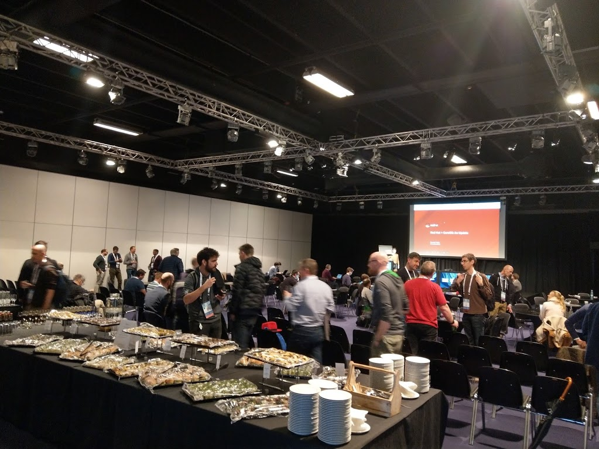
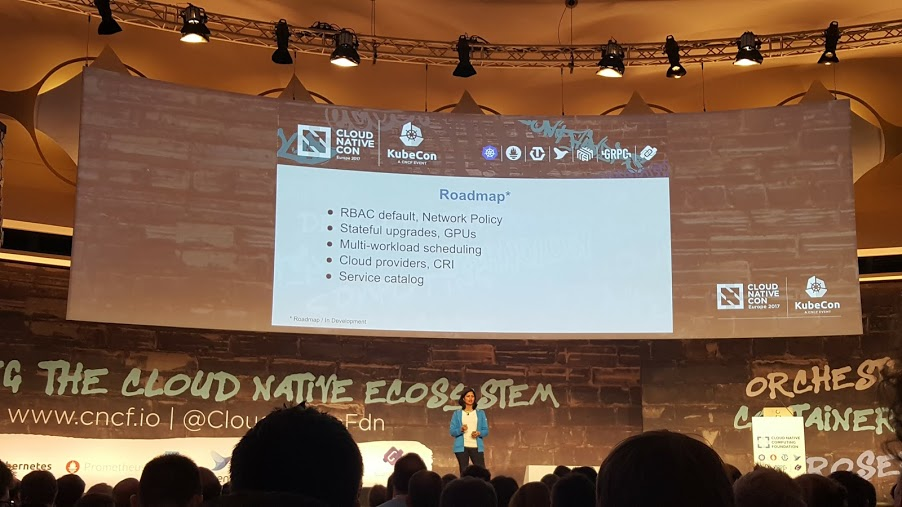
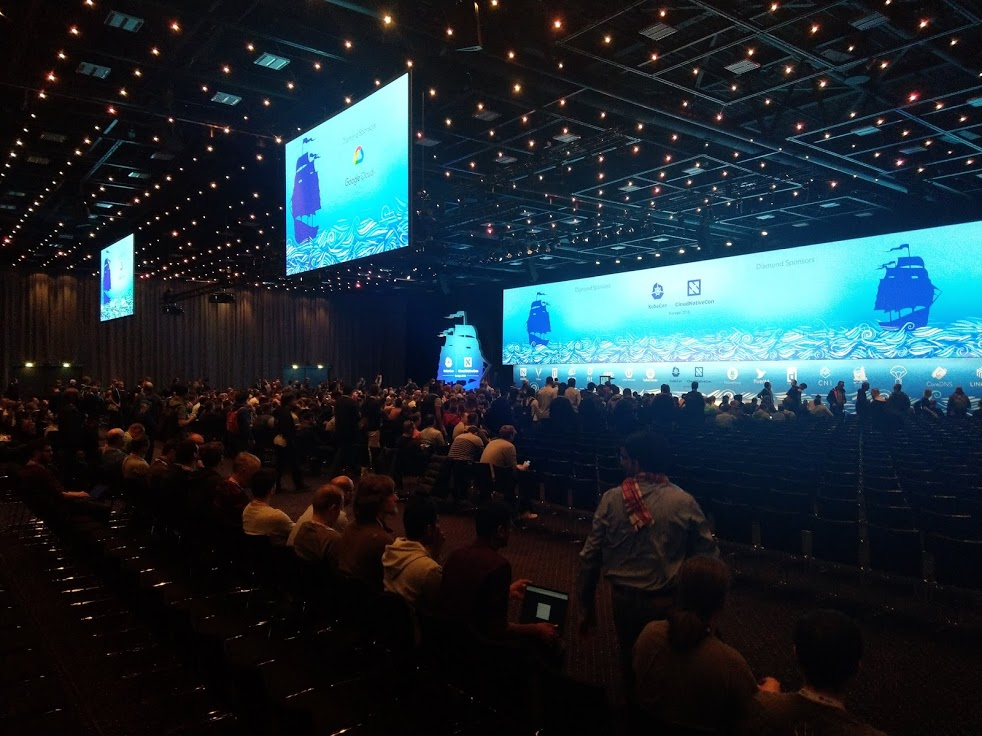
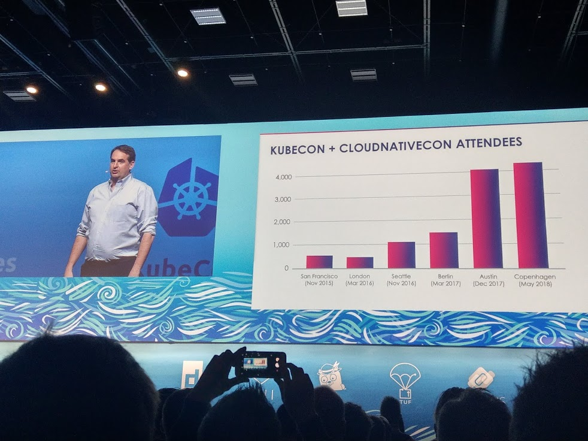

= KubeCon EU 2018 in Copenhagen (part 1)

:title: KubeCon Copenhagen 2018 (part 1)
:date: 2018-05-04
:tags: kubecon, kubernetes, conference, cloud-native
:category: conferences
:slug: kubecon-eu-2018-pt1
:authors: George Goh
:summary: Notes on KubeCon EU 2018

KubeCon in Europe this year was held in the city of Copenhagen in Denmark, 
spanning 3 days from 2-4 May (with an additional workshop day on 1 May).

This is part 1 of a multi-part report on my time at the conference.

= Pre-show event: OpenShift Commons Gathering

[#commons-gathering-eu-2018]
.OpenShift Commons Gathering in Copenhagen 2018

OpenShift Commons is a place for sharing of knowledge, experiences and practices
among users, partners, customers and contributors of OpenShift. 

Red Hat has been organizing OpenShift Commons Gatherings for the past few years
as a 'mini-conference' before each KubeCon, sharing customer case studies,
technology and roadmap updates, and panel discussions over the Cloud Native landscape.

Topics in this session included:

* Kubernetes Operator framework
** https://github.com/operator-framework
** The problem that the Operator framework is addressing is the 'day 2'
operations of applications such as updates, backups and scaling of a suite
of software (consider how this applies to an etcd cluster's creation,
adding/removing members, upgrades, etc).
* Machine Learning frameworks and use cases
** JupyterHub
** seldon-core
** radanalytics.io
** Pachyderm, ML/AI workflows, repeatability and compliance
** Kubeflow
** Repeatability in Data Science

The following is a recording of the entire session, and I think it's well worth
watching:
[#opernshift-commons-gathering-eu-2018-video]
video::-yBC_bA5ABk[youtube, title=OpenShift Commons Gathering EU 2018]

= KubeCon First impressions - exponential growth

When I attended the 2017 KubeCon EU in Berlin last year, it was well-attended.

[#kubecon-berlin-2017]
.KubeCon in Berlin 2017

But this year was phenomenal. The size of the main event hall felt 3 times
larger than the previous year.

[#kubecon-cph-2018]
.KubeCon in Copenhagen 2018

And sure enough, this was confirmed by Dan Kohn's keynote.

[#kubecon-cph-2018-dan-kohn-attendees]
.Attendees in KubeCon Copenhagen 2018

At about 4300 attendees, KubeCon in Copenhagen boasts the highest attendance
ever, almost triple the number who attended the Berlin event in 2017. The
conference program also grew from 8 concurrent tracks over 2.5 days in 2017,
to 14 over 3.5 days in 2018.

Dan's keynote also mentioned how fast the Cloud native Landscape was growing.

[#kubecon-cph-2018-dan-kohn-cncf-landscape]
.CNCF Landscape
[link=https://github.com/cncf/landscape/raw/master/landscape/CloudNativeLandscape_latest.png]
image::https://github.com/cncf/landscape/raw/master/landscape/CloudNativeLandscape_latest.png[Cloud Native Landscape,100%]

And also introduced the interactive Cloud Native Landscape at https://landscape.cncf.io/.

See the rest of his keynote https://docs.google.com/presentation/d/1ANqkYOILKmyU5M3fMjMbH9JfW7M87L3QaaOktEQGa7w/edit#slide=id.p10[here].

video::_CFgSksTT54[youtube, title=Cloud Native Landscape Intro]

= Keynotes 

I'm not going to describe every keynote in detail, but only the ones that resonated with me:

== Anatomy of a Production Kubernetes Outage
_Oliver Beattie, Head of Engineering, Monzo Bank_

video::OUYTNywPk-s[youtube]

Oliver walked through a production outage that Monzo experienced in 2017. 

Current account customers were experiencing payment failures after the
deployment of a new service. However, even after rolling back the deployment,
the failures remained and the outage continued.

Eventually, the failure was traced back to an incompatibility of the version of
linkerd that they were using, and their version of Kubernetes(see 
https://github.com/linkerd/linkerd/issues/1219).

I'm glossing over a lot of details here - more can be found at the following
links:

* Presentation: https://kccnceu18.sched.com/event/Dsan/keynote-anatomy-of-a-production-kubernetes-outage-oliver-beattie-head-of-engineering-monzo-bank
* Detailed Blog: https://community.monzo.com/t/resolved-current-account-payments-may-fail-major-outage-27-10-2017/26296/95?u=oliver

== Switching horses midstream: the challenge of migrating 150+ services to kubernetes
_Sarah Wells, Technical Director for Operations and Reliability, Financial Times_

video::H06qrNmGqyE[youtube]

FT started their container journey in 2015, starting with home-grown orchestration
for their containers.

I liked this presentation for the architecture and roadmap described.

Because of the legacy Docker architecture, FT chose to go with a parallel
deployment approach - deploying releases to both their existing infra *and*
to Kubernetes. At first, they had code in separate branches - one for legacy,
one for Kubernetes. However, they quickly found it difficult to manage merging 
the separate branches containing the different deployment mechanisms to the two 
stacks, and ended up using if/else conditions instead. 

A lot of details in the talk. Highly recommended watching.

* Presentation: https://kccnceu18.sched.com/event/Dsh7/keynote-switching-horses-midstream-the-challenges-of-migrating-150-microservices-to-kubernetes-sarah-wells-technical-director-for-operations-and-reliability-financial-times

_(to be continued)_